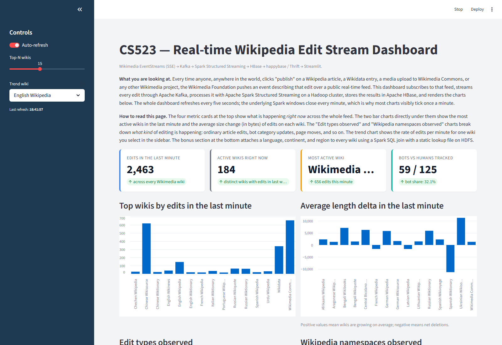
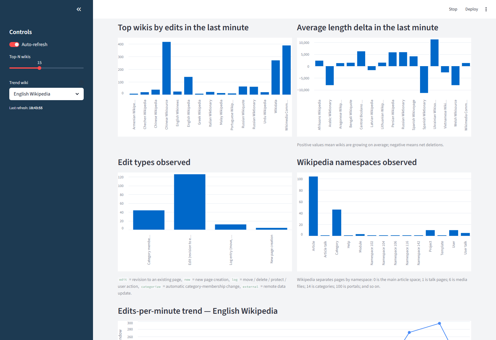
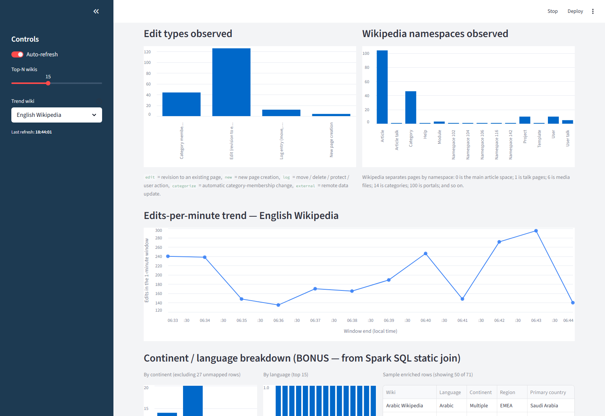
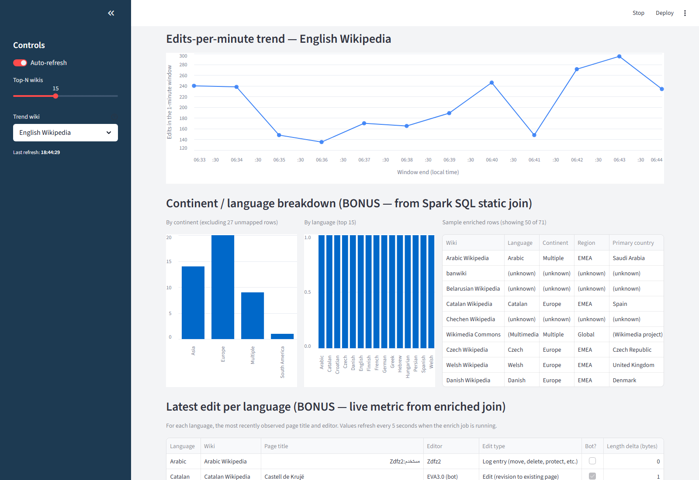
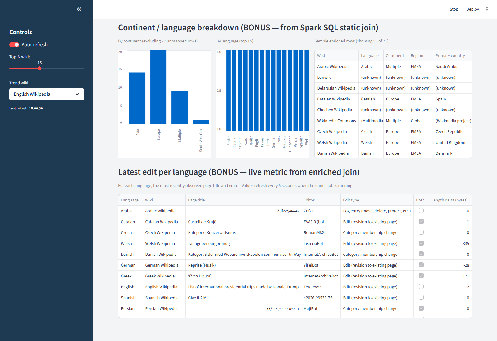
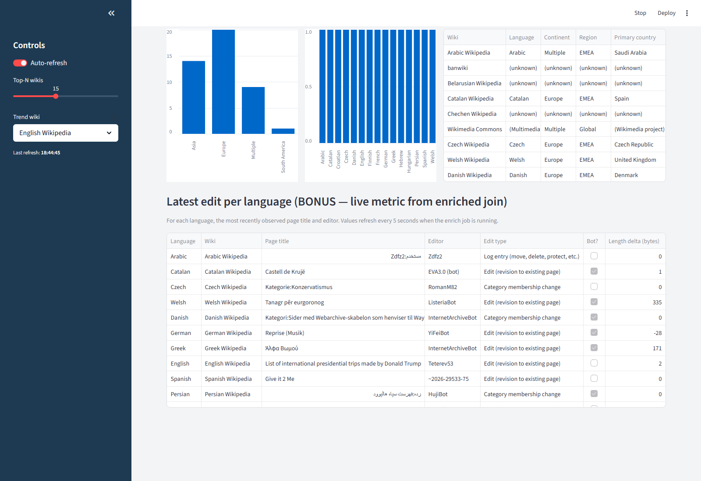

# Real-time Wikipedia Edit Stream Analytics Pipeline

A complete, runnable data pipeline that subscribes to the live feed of
every edit on every Wikipedia in the world, processes them in real time
on a distributed cluster, persists the results in a wide-column store,
and visualises them on an interactive dashboard.

**Authors**: Alvin Leonald Kabwama and Mercel Vubangsi.

---

## What this project does

As soon as anyone, anywhere in the world, clicks "publish" on a Wikipedia
article — in any language, on any Wikimedia project, including the major
language Wikipedias, Wikimedia Commons, Wikidata, and so on — the
following happens within seconds:

1. The Wikimedia Foundation's public **Server-Sent Events** feed pushes a
   JSON message describing that edit to every subscriber.
2. A Python subscriber inside this project reads that message, trims it
   to the fields we care about, and **publishes one message per edit to
   Apache Kafka**, keyed by the wiki code (`enwiki`, `frwiki`, and so on).
3. A **PySpark Structured Streaming** application running on Hadoop YARN
   consumes the topic and runs three concurrent queries:
   - a *live snapshot* of the most recent edit on every wiki,
   - a *one-minute tumbling-window edit count* per wiki,
   - a *one-minute tumbling-window average byte change* per wiki.
4. A second Spark application joins every incoming edit against a
   hand-authored language-metadata file on HDFS (wiki code → language
   name, continent, region, primary country) using a **Spark SQL
   broadcast join**, then writes the enriched rows to HBase.
5. All three streaming results plus the enriched join output are written
   to **Apache HBase**, keyed for fast lookup and time-range scans.
6. A **Streamlit dashboard** reads HBase over the Thrift protocol and
   refreshes every five seconds.

Nothing is mocked. The dashboard you open in your browser is reading
real Wikipedia edits made seconds ago in dozens of languages around the
world.

The Wikimedia feed is genuinely real-time: the upstream source pushes
new events as fast as they happen, with no polling, no API key, and no
rate limit.

---

## Architecture

```
                  ┌────────────────────────────────┐
                  │  Wikimedia EventStreams (SSE)  │
                  │  stream.wikimedia.org/v2/      │
                  │     stream/recentchange        │
                  └─────────────┬──────────────────┘
                                │  ~100 events / sec
                                │  (every Wikipedia edit, globally)
                                ▼
                  ┌─────────────────────────────────┐
                  │  Python Server-Sent Events       │
                  │  subscriber                      │
                  │  producer/producer.py            │
                  │                                  │
                  │  - parses each event             │
                  │  - trims to relevant fields      │
                  │  - publishes one Kafka message   │
                  │    per edit, keyed by wiki       │
                  └─────────────┬───────────────────┘
                                │  one JSON message per edit
                                ▼
                  ┌─────────────────────────────────┐
                  │  Apache Kafka                   │
                  │  topic: wikipedia-raw           │
                  │  partitions=1  replication=1    │
                  └─────────────┬───────────────────┘
                                │
                                ▼
        ┌──────────────────────────────────────────────────────┐
        │   Apache Spark Structured Streaming on Hadoop YARN   │
        │   spark_app/stream_processor.py                      │
        │                                                      │
        │   - parses each message into a typed DataFrame       │
        │   - applies a 30-second event-time watermark         │
        │   - runs three streaming queries concurrently:       │
        │                                                      │
        │       Q1  live snapshot of latest edit per wiki      │
        │       Q2  1-minute tumbling count per wiki           │
        │       Q3  1-minute tumbling average byte delta       │
        │                                                      │
        │   - writes each batch to HBase via foreachBatch      │
        │     and the happybase Thrift client                  │
        │                                                      │
        │   spark_app/enrich_with_join.py                      │
        │                                                      │
        │   - separate Spark application that joins the same   │
        │     Kafka stream against a static language-metadata  │
        │     JSON file on HDFS using a broadcast join, then   │
        │     writes the enriched rows to HBase                │
        └──────────────────────────────┬───────────────────────┘
                                       │
                          ┌────────────┼────────────┐
                          ▼            ▼            ▼
              ┌────────────────┐ ┌──────────┐  ┌────────────────────┐
              │ wikipedia_live │ │ wikipedia│  │ wikipedia_enriched │
              │                │ │   _agg   │  │                    │
              │ latest edit    │ │ windowed │  │ edits joined with  │
              │ per wiki       │ │ metrics  │  │ language metadata  │
              └────────────────┘ └──────────┘  └────────────────────┘
                                       │
                                       │  happybase Thrift
                                       │  (TCP port 9090)
                                       ▼
                           ┌──────────────────────┐
                           │  Streamlit dashboard │
                           │  dashboard/app.py    │
                           │  refreshes every 5 s │
                           └──────────────────────┘
```

---

## Tech stack

| Layer | Technology | Role in this project |
|---|---|---|
| Data source | Wikimedia EventStreams (Server-Sent Events) | The Wikimedia Foundation's public feed of every edit on every Wikimedia project, in real time. Free, no API key, no rate limit. |
| Ingestion | Python 3 with `requests` and `kafka-python` | A long-running HTTP/2 subscriber that parses incoming SSE events and publishes them to Kafka one at a time. |
| Message broker | Apache Kafka 3.4 | Decouples the producer from the downstream consumers. Buffers events so Spark can crash and restart without losing data. |
| Stream processing | Apache Spark 3.1.2 Structured Streaming on YARN | Distributes the work across multiple containers. Applies watermarks, windowed aggregations, and exactly-once checkpointing. |
| Static enrichment | Spark SQL broadcast join with HDFS | Joins the live stream with an 85-row JSON lookup of language metadata on HDFS. The static side is broadcast to every executor, so the join causes zero shuffle. |
| Sink | Apache HBase 2.2 | A wide-column NoSQL store. Three tables, each keyed for the dashboard's access pattern. |
| Bridge to dashboard | Apache Thrift via the `happybase` Python client | Lets a Python dashboard read HBase without dragging in the Java client. Listens on TCP port 9090. |
| Dashboard | Streamlit | Single-page Python web UI. Renders metrics, bar charts, line charts, and tables. Auto-refreshes every five seconds. |
| Container | The course's `mmukadam/cs523bdt-lab:v4.0` image | Bundles Hadoop, YARN, HBase, Spark, and the rest of the JVM stack so the whole pipeline runs on one host. |

---

## What you will see when you open the dashboard

Open `http://localhost:8501` after starting the pipeline. The page is
divided into the following sections, top to bottom. A screenshot of
each section is embedded below so you can match what the README is
describing against what you see in the browser.

### 1. Page header and 2. Pipeline overview (four metric cards)



The title bar identifies the project. Directly below it, a two-paragraph
plain-language description explains the data source (Wikimedia
EventStreams) and how to read the rest of the page.

The four cards underneath are the live "pipeline heartbeat":

| Card | What it shows | Why it is useful |
|---|---|---|
| **Edits in the last minute** | Sum across every wiki of the per-wiki edit counts in the most recent one-minute window. | The heartbeat of the entire feed; this number tells you whether the pipeline is alive. Typically 1,000–3,000. |
| **Active wikis right now** | Number of distinct wikis with at least one edit in the most recent window. | On a typical hour you see 100–180 different wikis. Quiet hours are below 100; peak hours go above 200. |
| **Most active wiki** | The wiki with the highest edit count this minute. Wikimedia Commons usually wins because automated categorization bots run constantly on it. | Quick signal of which Wikimedia community is most active right now. |
| **Bots vs humans tracked** | Count of bot edits and human edits among the wikis currently in `wikipedia_live`. | Wikipedia relies on a large fleet of bots (anti-vandalism, citation-cleanup, category-membership). Roughly a third of all edits are bot edits. |

### 3. Top wikis by edits in the last minute, and 4. Average length delta



**Top wikis by edits in the last minute** (left chart) — a bar chart of
the most-edited wikis in the most recent one-minute window. Adjust how
many wikis to show using the **Top-N wikis** slider in the sidebar.
The taller the bar, the more edits that wiki received in the last sixty
seconds. Wikimedia Commons (file uploads) and Wikidata (structured-data
updates) often dominate because of automated bots.

**Average length delta in the last minute** (right chart) — for each of
the same wikis, the average byte change per edit. **Positive bars** mean
the wikis are *growing on average* (people are adding content).
**Negative bars** mean *net deletions* — vandalism reverts, section
blanking, redirects, or empty-page log entries. The caption directly
under this chart restates the meaning of positive vs negative.

### 5. Edit types observed, and 6. Wikipedia namespaces observed



**Edit types observed** (left chart) — every event from the Wikimedia
feed is one of five kinds:

| Type | Meaning |
|---|---|
| **Edit** | A revision to an existing page (the most common). |
| **New page creation** | A brand-new page being added. |
| **Log entry** | A page move, deletion, protection change, user creation, or other administrative action. |
| **Category membership change** | Automatic event fired when a page is added to or removed from a category. Bot-driven. |
| **External data update** | A remote system (e.g. Wikidata) writing a value used by a page. |

The chart counts how many of the currently-tracked wikis received each
type of event in the most recent batch.

**Wikipedia namespaces observed** (right chart) — Wikipedia separates
pages into namespaces. The most common ones:

| Number | Name | Example |
|---|---|---|
| 0 | Article | `Big Data` |
| 1 | Article talk | `Talk:Big Data` |
| 2 | User | `User:Alvin` |
| 3 | User talk | `User talk:Alvin` |
| 4 | Project | `Wikipedia:Village Pump` |
| 6 | File | `File:Logo.png` |
| 10 | Template | `Template:Citation needed` |
| 14 | Category | `Category:Big Data` |
| 100 | Portal | `Portal:Science` |

Article (namespace 0) typically dominates. Category (namespace 14)
also ranks high because of bot-driven categorization. Custom
project-specific namespaces appear as `Namespace 102`, `Namespace 116`,
etc. — those are wiki-specific extensions outside the standard set.

### 7. Edits-per-minute trend for a selected wiki



A line chart of the per-minute edit count for whichever wiki you pick
in the sidebar dropdown (default: **English Wikipedia**). Each circle
is one completed one-minute window from Spark's Q2 query — a new
circle pops in at the right edge every minute, and the oldest one
scrolls off the left. The y-axis is auto-scaled to the actual range so
fluctuations are visible (it does not anchor at zero).

For very active wikis (English, Wikidata, Commons) you typically see
200–600 edits per minute. For smaller language wikis the line stays
near zero with occasional spikes.

### 8. Continent / language breakdown (bonus: Spark SQL static join)



This is the **+2 bonus** delivered by `spark_app/enrich_with_join.py`.
That second Spark application takes every incoming edit and joins it
against a hand-authored language-metadata file on HDFS
(`data/static/language_metadata.json`) using a **Spark SQL broadcast
join**. The output table `wikipedia_enriched` carries the original
edit fields plus four new columns: `language`, `continent`, `region`,
`primary_country`.

- **By continent** (left bar chart) — how many of the currently-tracked
  wikis belong to each continent. "Multiple" covers wikis like English,
  Spanish, and Arabic that span many countries; cross-project wikis
  like Wikimedia Commons and Wikidata are also "Multiple".
- **By language** (middle bar chart) — top 15 languages by tracked-wiki
  count, including non-Wikipedia editions like Wiktionary, Wikibooks,
  and Wikisource. Special wikis (Commons, Wikidata, Meta) appear as
  "(Multimedia commons)", "(Wikidata)", "(Meta coordination)", and so on.
- **Sample enriched rows** (right table) — up to 50 most recent enriched
  edits showing the wiki, decoded language, continent, region, primary
  country, edit type, page title, editor, and whether the editor was a
  bot.

### 9. Latest edit per language (bonus: live metric)



For each language in the enrichment lookup, this table shows the
**most recently observed page title and editor**. Because the
underlying data refreshes every cycle, the page-title and editor
columns shift continuously while the enrichment job is running —
this is the most "alive-looking" view on the page.

Columns:
- **Language** — decoded from the wiki code via the bonus join.
- **Wiki** — decoded from the wiki code via `pretty_wiki()` (the table
  shows pretty names like "French Wikipedia", not raw codes).
- **Page title** — the article being edited.
- **Editor** — the user (or IP address, or temporary user ID for
  unregistered editors).
- **Edit type** — Edit, New page creation, Log entry, Category change,
  or External data update.
- **Bot?** — true if the edit came from a bot account.
- **Length delta (bytes)** — how many bytes were added (positive) or
  removed (negative).

### Sidebar controls

| Control | Effect |
|---|---|
| **Auto-refresh** toggle | Turns the five-second refresh cycle on and off. |
| **Top-N wikis** slider | How many wikis to show in the bar charts (5 to 30, step 5). |
| **Trend wiki** dropdown | Which wiki's edits-per-minute trend to plot. The dropdown lists wikis by their human-readable name (e.g. "English Wikipedia") and is sorted by current activity. |
| **Last refresh** timestamp | When the dashboard last re-read HBase. |

The dashboard never shows raw Wikimedia codes (`enwiki`, `frwikibooks`,
`commonswiki`) in the user interface — every code is decoded to a
plain-English name through `pretty_wiki()`. The raw codes are still the
canonical identifiers in Kafka, HBase, and the static enrichment file
— see the glossary section below to decode any code you encounter
while inspecting the raw data.

---

## Data flow timing

| Stage | Frequency |
|---|---|
| Wikimedia SSE push | Pushed as events happen — typically 50 to 200 per second worldwide |
| Producer publishes to Kafka | Once per event (no batching) |
| Spark micro-batch trigger (live snapshot) | Every 10 seconds |
| Spark micro-batch trigger (windowed queries) | Every 30 seconds |
| Tumbling window length | 1 minute (event-time, watermarked at 30 seconds) |
| Dashboard refresh | Every 5 seconds |

End-to-end latency from an edit on Wikipedia to a visible change in the
dashboard is typically between 10 and 25 seconds.

---

## Running the project

### Prerequisites

- **Docker Desktop installed and running.** The whole pipeline lives
  inside the course-provided `mmukadam/cs523bdt-lab:v4.0` image, which
  is a fat all-in-one container running Hadoop (HDFS + YARN), HBase,
  Spark, Hive, Pig, Sqoop, Flume, and the Java 8 JVM. Without Docker
  running you cannot start anything.
- **Roughly 8 GB of free memory for the Docker VM.** The lab container
  alone reserves about 6 GB for the JVM heaps of YARN + HBase + Spark.
  Kafka, ZooKeeper, and Postgres need another ~1 GB combined.
- **A working internet connection.** On first run Docker pulls about
  5 GB of images. The pipeline itself talks to Wikimedia EventStreams
  (https://stream.wikimedia.org) from inside the container, so the host
  needs outbound HTTPS reachable.

### Step-by-step

1. **Clone the repository:**

   ```bash
   git clone https://github.com/alvinkabwama/cs523-bdt-project-wikipedia.git
   cd cs523-bdt-project-wikipedia
   ```

2. **Bring up the stack:**

   ```bash
   docker compose up -d
   ```

   This is the single most important step. It starts **four containers**
   and they must all stay running for the rest of the project to work:

   | Container | Image | Role |
   |---|---|---|
   | `zookeeper-server` | `mmukadam/zookeeper:v3.8` | Distributed coordination service used by both Kafka and HBase |
   | `kafka-server` | `mmukadam/kafka:v7.4.0` | The Kafka broker that receives messages from the producer and feeds Spark |
   | `hive-metastore-db` | `mmukadam/postgres:v16` | Postgres for the bundled Hive metastore (the lab image needs it; this project does not use Hive directly) |
   | **`cs523bdt-lab`** | **`mmukadam/cs523bdt-lab:v4.0`** | **The course lab container.** It bundles Hadoop (HDFS + YARN), HBase, Spark, Hive, Pig, Sqoop, Flume, Avro, Kafka tools, and the Java 8 JVM. Every `spark-submit`, every `hbase shell` command, every Streamlit run, and every Python script in this repo executes inside this container. |

   On the first run Docker downloads about 5 GB of images. Subsequent
   runs reuse the local cache and start in about 30 seconds.

   **Verify all four containers are up before continuing:**

   ```bash
   docker ps --format "table {{.Names}}\t{{.Status}}"
   ```

   You should see four lines, all "Up". If `cs523bdt-lab` is missing or
   in a `Restarting` state, none of the following steps will work — fix
   it before going further.

3. **Run the one-time setup script:**

   ```bash
   ./setup_container.sh
   ```

   This installs the Python libraries, starts YARN and HBase, creates the
   Kafka topic and the three HBase tables, and uploads the static
   `language_metadata.json` lookup file to HDFS.

4. **Open four terminals and run one command in each.** The architecture
   has four independent processes, so each gets its own terminal.

   Every command in this step starts with `docker exec -it cs523bdt-lab`
   — that means "run this inside the lab container that step 2 brought
   up." If step 2's `cs523bdt-lab` container is not running, these
   commands will all fail with `Error: No such container`. Re-check
   `docker ps` if that happens.

   **Terminal A — the producer:**

   ```bash
   docker exec -it cs523bdt-lab python3 /opt/project/producer/producer.py
   ```

   You should see `sent=200 rate=X.X events/sec` within about 30 seconds.

   **Terminal B — the main Spark streaming job:**

   ```bash
   docker exec -it cs523bdt-lab spark-submit \
     --master yarn --deploy-mode client \
     --packages org.apache.spark:spark-sql-kafka-0-10_2.12:3.1.2 \
     /opt/project/spark_app/stream_processor.py
   ```

   **Terminal C — the bonus enrichment Spark job:**

   ```bash
   docker exec -it cs523bdt-lab spark-submit \
     --master yarn --deploy-mode client \
     --executor-memory 768m --num-executors 1 \
     --packages org.apache.spark:spark-sql-kafka-0-10_2.12:3.1.2 \
     /opt/project/spark_app/enrich_with_join.py
   ```

   **Terminal D — the dashboard:**

   ```bash
   docker exec -it cs523bdt-lab streamlit run /opt/project/dashboard/app.py \
     --server.address 0.0.0.0
   ```

5. **Open `http://localhost:8501` in your browser.**

### Other web interfaces while the pipeline is running

| URL | What it is |
|---|---|
| `http://localhost:9870` | The Hadoop Distributed File System name-node UI |
| `http://localhost:8088` | The YARN resource manager UI; both Spark applications appear here as `WikipediaEditsProcessor` and `WikipediaEnrichJoin` |
| `http://localhost:16010` | The HBase master UI; browse the three tables and their column families |
| `http://localhost:4040` | The Spark application UI; query progress, batch durations, and the physical plan |
| `http://localhost:8501` | The Streamlit dashboard itself |

---

## Repository structure

```
cs523-bdt-project-wikipedia/
├── docker-compose.yml          Brings up the full lab stack
├── setup_container.sh          One-shot idempotent setup script
├── data/
│   └── static/
│       └── language_metadata.json   Hand-authored language lookup
├── producer/
│   ├── producer.py             Wikimedia SSE → Kafka
│   └── requirements.txt
├── spark_app/
│   ├── stream_processor.py     Kafka → Spark → HBase (live + windowed)
│   └── enrich_with_join.py     Spark SQL static-data join (bonus)
├── hbase/
│   └── schema.hbase            HBase shell table creation
├── dashboard/
│   ├── app.py                  Streamlit dashboard
│   └── requirements.txt
├── docs/
│   └── architecture.md         Detailed design document
└── .streamlit/
    └── config.toml             Dashboard color theme
```

---

## Glossary — what the abbreviated codes in the data mean

### How to decode any wiki code

Wikimedia uses short codes like `enwiki`, `frwikibooks`, or `zh_yuewiki`
to identify each project. The pattern is **language code + project name**.
Once you know the two halves, any code is decodable.

**Language codes** are two- or three-letter ISO-639 codes:

| Code | Language | Code | Language |
|---|---|---|---|
| `en` | English | `ja` | Japanese |
| `de` | German | `ko` | Korean |
| `fr` | French | `zh` | Chinese |
| `es` | Spanish | `ru` | Russian |
| `pt` | Portuguese | `ar` | Arabic |
| `it` | Italian | `hi` | Hindi |
| `nl` | Dutch | `bn` | Bengali |
| `pl` | Polish | `vi` | Vietnamese |
| `sv` | Swedish | `tr` | Turkish |
| `simple` | Simple English (special) | `he` | Hebrew |

The full lookup covers ~120 languages and lives in `dashboard/app.py`
(`LANGUAGE_CODE_TO_NAME`).

**Project suffixes** identify which Wikimedia project the wiki belongs to:

| Suffix | Project | What it is |
|---|---|---|
| `wiki` | Wikipedia | The familiar online encyclopaedia |
| `wiktionary` | Wiktionary | Free multilingual dictionary |
| `wikibooks` | Wikibooks | Open-content textbooks |
| `wikiquote` | Wikiquote | Collection of quotations |
| `wikisource` | Wikisource | Public-domain primary source documents |
| `wikinews` | Wikinews | Citizen journalism |
| `wikiversity` | Wikiversity | Free learning resources |
| `wikivoyage` | Wikivoyage | Travel guide |

**Worked examples:**

| Wiki code | Decoded |
|---|---|
| `enwiki` | English Wikipedia |
| `frwiki` | French Wikipedia |
| `frwikibooks` | French Wikibooks |
| `zhwikisource` | Chinese Wikisource |
| `enwiktionary` | English Wiktionary |
| `de wikiquote` (the `de` prefix) | German Wikiquote |
| `simplewiki` | Simple English Wikipedia |

And a handful of **special wikis** that do not follow the language+project
pattern — they are cross-project resources rather than language editions:

| Code | What it is |
|---|---|
| `commonswiki` | Wikimedia Commons — central repository for free media files (images, audio, video) used across every Wikipedia |
| `wikidatawiki` | Wikidata — the structured-data knowledge base that powers Wikipedia infoboxes and many other projects |
| `metawiki` | Wikimedia Meta-Wiki — used to coordinate the Wikimedia movement across all projects |
| `mediawikiwiki` | The official documentation site for the MediaWiki software that runs Wikipedia |
| `specieswiki` | Wikispecies — a free directory of life forms (taxonomy) |
| `incubatorwiki` | Where new language editions of Wikipedia are developed before being granted their own wiki |
| `outreachwiki` | Wikimedia Outreach — community programmes, education projects |
| `loginwiki` | Wikimedia central login — the wiki that handles single sign-on across projects |
| `sourceswiki` | Wikisource multilingual — top-level coordination for Wikisource editions |
| `foundationwiki` | The Wikimedia Foundation's own organisational site |

**Inside the dashboard you will not see these codes raw** — the dashboard
calls `pretty_wiki(code)` everywhere and renders the decoded version.
This README explains the codes for anyone reading the underlying Kafka
messages, HBase row keys, or the static enrichment file directly.

### Wikimedia wiki codes most likely to appear

| Code | Wiki / project |
|---|---|
| `enwiki` | English Wikipedia |
| `simplewiki` | Simple English Wikipedia |
| `dewiki` | German Wikipedia |
| `frwiki` | French Wikipedia |
| `eswiki` | Spanish Wikipedia |
| `ptwiki` | Portuguese Wikipedia |
| `itwiki` | Italian Wikipedia |
| `ruwiki` | Russian Wikipedia |
| `jawiki` | Japanese Wikipedia |
| `zhwiki` | Chinese Wikipedia |
| `arwiki` | Arabic Wikipedia |
| `kowiki` | Korean Wikipedia |
| `hiwiki` | Hindi Wikipedia |
| `nlwiki` | Dutch Wikipedia |
| `plwiki` | Polish Wikipedia |
| `svwiki` | Swedish Wikipedia |
| `viwiki` | Vietnamese Wikipedia |
| `idwiki` | Indonesian Wikipedia |
| `trwiki` | Turkish Wikipedia |
| `commonswiki` | Wikimedia Commons (free media file repository) |
| `wikidatawiki` | Wikidata (cross-project structured-data store) |
| `metawiki` | Wikimedia Meta (coordination wiki) |
| `mediawikiwiki` | MediaWiki software documentation |
| `specieswiki` | Wikispecies (taxonomy database) |
| `incubatorwiki` | Wikimedia Incubator (where new language editions are developed) |

The complete mapping covers ~85 wikis and lives at
`data/static/language_metadata.json`.

### Wikimedia edit types

| Type | Meaning |
|---|---|
| `edit` | An ordinary edit to an existing page |
| `new` | Creation of a new page |
| `log` | A log entry (page protection, deletion, move, user creation, and so on) |
| `categorize` | An automatic event when a page is added to or removed from a category |
| `external` | An external action (Wikidata writes a value used by a Wikipedia page) |

### Wikimedia namespaces

A "namespace" is Wikipedia's way of separating different kinds of pages.
The most common ones:

| Number | Name | Example |
|---|---|---|
| 0 | Article (main namespace) | `Big Data` |
| 1 | Article talk | `Talk:Big Data` |
| 2 | User | `User:ExampleUser` |
| 3 | User talk | `User talk:ExampleUser` |
| 4 | Project (Wikipedia:) | `Wikipedia:Village Pump` |
| 6 | File | `File:Big Data.png` |
| 10 | Template | `Template:Citation needed` |
| 14 | Category | `Category:Big Data` |

### Software components

| Term | Full name / role |
|---|---|
| Server-Sent Events (SSE) | A long-lived one-way HTTP protocol where the server pushes lines of text to the client whenever it has something new. Wikimedia uses it for the recent-changes feed. |
| Kafka | Apache Kafka, a distributed log-based message broker. Sits between the producer and the consumers. |
| Spark | Apache Spark, a distributed compute engine. We use its Structured Streaming and SQL modules. |
| YARN | Yet Another Resource Negotiator, the Hadoop cluster scheduler that allocates containers for Spark to run in. |
| HDFS | Hadoop Distributed File System; where Spark checkpoints and where the static language metadata lookup lives. |
| HBase | Apache HBase, a distributed wide-column NoSQL store on top of HDFS; the live-results sink. |
| Thrift | Apache Thrift, a language-agnostic RPC protocol; HBase exposes itself on port 9090 over Thrift. |
| happybase | A Python library that speaks the HBase Thrift protocol, so a Python dashboard can read HBase. |
| Streamlit | A Python library that turns a Python script into an interactive web dashboard. |

---

## Caveats and known limitations

- **Single-broker development cluster.** Kafka, ZooKeeper, and HBase all
  run with a replication factor of one. Suitable for a development or
  demo cluster; not production-grade fault tolerance.
- **YARN headroom is tight.** The two Spark applications (the streaming
  one and the enrichment one) together fit into roughly 7 GB of the
  8 GB YARN cluster. The enrichment job is launched with reduced executor
  memory to leave headroom for the streaming job.
- **Unknown wikis in the bonus join.** The static `language_metadata.json`
  file covers about 85 wikis. Less-active wikis whose codes are not in
  the file appear in HBase with `(unknown)` in the language, continent,
  region, and primary-country columns. The dashboard filters those rows
  out of the bar charts but keeps them in the sample-rows table so the
  LEFT JOIN behaviour is still visible.
- **SSE reconnection.** If the producer loses its connection to Wikimedia
  (for example because of a transient network blip) it reconnects every
  five seconds. Events emitted by Wikipedia during the gap are not
  replayed — they are lost upstream of Kafka. This is the standard
  behaviour for push-streaming consumers.

---

## License

This project was produced for the CS523 Big Data Technologies course at
Maharishi International University. The code is provided as-is for
educational and reference purposes.
